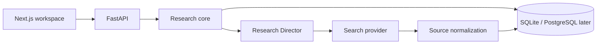

# ResearchOS Architecture

ResearchOS is an application-owned, evidence-first research workflow. The V1 vertical slice is deliberately small: create a project, generate a research plan, run a literature discovery provider, persist candidate sources, and inspect them.

## Boundaries

- `apps/web`: Next.js desktop interface.
- `apps/api`: FastAPI HTTP API and SQLite persistence.
- `packages/research-core`: workflow and domain rules, independent of transport and models.
- `packages/agents`: typed role contracts and provider interfaces. Agents propose artifacts; the application owns state and gates.
- `packages/shared-types`: TypeScript API contracts.
- `packages/venue-config`: editable venue profiles.
- `evals`: probabilistic and integrity-oriented evaluation fixtures.

## Runtime flow

The search provider is replaceable. `demo` is deterministic for local use and tests; `openai` is configured only when credentials are present. Provider output is always recorded with its query and run provenance.

## Integrity invariants

1. Workflow transitions are explicit and validated.
2. Generated artifacts are append-only versions; canonical metadata changes go through the librarian boundary.
3. Formal drafting cannot precede the research and approval gates.
4. Every run and human decision has a stable UUID and timestamp.
5. Candidate source metadata is never silently promoted to verified metadata.
6. Confidentiality classification travels with every artifact.

## Production evolution

SQLite is the V1 local store. Repository interfaces keep the path to PostgreSQL open. Background calls are synchronous in this slice but represented as durable agent runs so a queue can resume them later. Filesystem/S3 storage, PDF extraction, the claim ledger, and full Agents SDK orchestration land in subsequent milestones.
